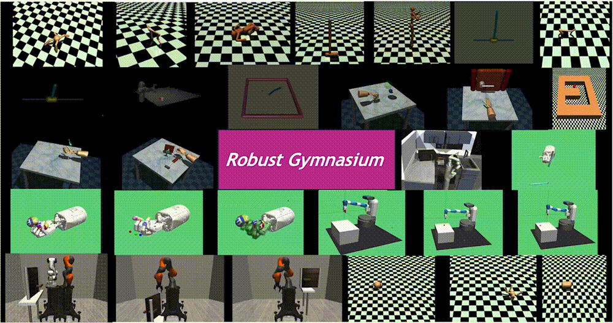

.. Robust Gymnasium documentation master file, created by
   sphinx-quickstart on Thu Nov 14 19:51:51 2024.
   You can adapt this file completely to your liking, but it should at least
   contain the root `toctree` directive.

Robust Gymnasium documentation
==============================

Driven by inherent uncertainty and the sim-to-real gap, robust reinforcement learning (RL) seeks to improve resilience against the complexity and variability in agent-environment sequential interactions. Despite the existence of a large number of RL benchmarks, there is a lack of standardized benchmarks for robust RL. Current robust RL policies often focus on a specific type of uncertainty and are evaluated in distinct, one-off environments. In this work, we introduce Robust Gymnasium, a unified modular benchmark designed for robust RL that supports a wide variety of disruptions across all key RL components—agents’ observed state and reward, agents’ actions, and the environment. Offering over sixty diverse task environments spanning control and robotics, safe RL, and multi-agent RL, it provides an open-source and user-friendly tool for the community to assess current methods and foster the development of robust RL algorithms. In addition, we benchmark existing standard and robust RL algorithms within this framework, uncovering significant deficiencies in each and offering new insights.

.. toctree::
   :maxdepth: 4
   :caption: Contents:

.. centered:: `Robust Gymnasium: A Unified Modular Benchmark for Robust Reinforcement Learning`

.. toctree::
   :hidden:
   :caption: Introduction

   introduction/overview
   introduction/quick_start

.. toctree::
   :hidden:
   :caption: Environments

   environments/robust_mujoco
   environments/robust_safe_agent
   environments/robust_multi_agent

.. toctree::
   :hidden:
   :caption: Disruptor

   disruptors/Gaussian_attack/index
   disruptors/Uniform_attack/index
   disruptors/LLM_attack/index

.. toctree::
   :hidden:
   :caption: API

   api/utils/index

.. toctree::
   :hidden:
   :caption: Development

`Github <https://github.com/SafeRL-Lab/Robust-Gymnasium>`__

`Contribute to the Docs <https://github.com/SafeRL-Lab/Robust-Gymnasium/tree/main/docs>`__