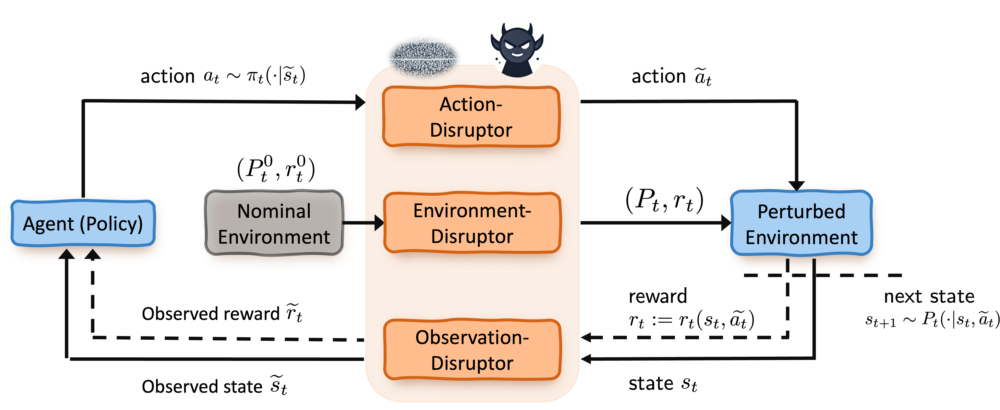

.. Robust Gymnasium documentation master file, created by Robust RL Team
   sphinx-quickstart on Thu Nov 14 19:51:51 2024.
   You can adapt this file completely to your liking, but it should at least
   link back this repository and cite this work.

Overview
--------------------------------
This benchmark aims to advance robust reinforcement learning (RL) for real-world applications and domain adaptation. The benchmark provides a comprehensive set of tasks that cover various robustness requirements in the face of uncertainty on state, action, reward and environmental dynamics, and span diverse applications including control, robot manipulations, dexterous hand, and so on (This repository is under actively development. We appreciate any constructive comments and suggestions).

🔥 Benchmark Features:
**********************

* High Modularity: It is designed for flexible adaptation to a variety of research needs, featuring high modularity to support a wide range of experiments.
* Task Coverage: It provides a comprehensive set of tasks to evaluate robustness across different RL scenarios (at least 170 tasks).
* High Compatibility: It can be seamless and compatible with a wide range of existing environments.
* Support Vectorized Environments: It can be useful to enable parallel processing of multiple environments for efficient experimentation.
* Support for New Gym API: It fully supports the latest standards in Gym API, facilitating easy integration and expansion.
* LLMs Guide Robust Learning: Leverage LLMs to set robust parameters (LLMs as adversary policies).

🔥 Benchmark Tasks:
**********************

* Robust MuJoCo Tasks: Tackle complex simulations with enhanced robustness.
* Robust Box2D Tasks: Engage with 2D physics environments designed for robustness evaluation.
* Robust Robot Manipulation Tasks: Robust robotic manipulation with Kuka and Franka robots.
* Robust Safety Tasks: Prioritize safety in robustness evaluation.
* Robust Android Hand Tasks: Explore sophisticated hand manipulation challenges in robust settings.
* Robust Dexterous Tasks: Advance the robust capabilities in dexterous robotics.
* Robust Fetch Manipulation Tasks: Robust object manipulation with Fetch robots.
* Robust Robot Kitchen Tasks: Robust manipulation in Kitchen environments with robots.
* Robust Maze Tasks: Robust navigation robots.
* Robust Multi-Agent Tasks: Facilitate robust coordination among multiple agents.
* Each of these robust tasks incorporates robust elements such as robust observations, actions, reward signals, and dynamics to evaluate the robustness of RL algorithms.

🔥 RL against Uncertainty/Perturbation
******************************************************************

Reinforcement learning problems are formulated such that an agent seeks a policy that optimizes the long-term expected return through interacting with an environment. While standard RL has been heavily investigated recently, its use can be significantly hampered in practice due to noise, malicious attacks, the sim-to-real gap, domain generalization requirements, or even a combination of these and more factors. Consequently, in addition to maximizing the cumulative rewards, robustness to unexpected uncertainty/perturbation emerges as another critical goal for RL, especially in high-stakes applications such as robotics, financial investments, autonomous driving, and so on. This leads to a surge of considerations of more robust RL algorithms for different problems, termed as robust RL, including but not limited to single-agent RL, safe RL, and multi-agent RL.

🔥 MDP with Disruption
***********************************************************************

Robust RL problems typically consist of three modules:

- **An agent (a policy)**: tries to learn a strategy π (a policy) based on the observation from the environment to achieve optimal long-term return.
- **An environment/task**: a task that determines the agents' immediate reward \( r(· \mid s, a) \) and the physical or logical dynamics (transition function \( P(· \mid s, a) \)).
- **The disruptor module**: represents the uncertainty/perturbation events that happen during any parts of the interaction process between the agent and environment, with different modes, sources, and frequencies.

We illustrate the framework of robust RL for single-agent problems for instance:

.. figure:: ../_static/images/tasks-illustration2.png
   :width: 90%
   :align: center

🔥 Our Vision: 
**********************

We hope this benchmark serves as a useful platform for pushing the boundaries of RL in real-world problems --- promoting robustness and domain adaptation ability!

`Github <https://github.com/SafeRL-Lab/Robust-Gymnasium>`__

`Contribute to the Docs <https://github.com/PKU-Alignment/safety-gymnasium/blob/main/CONTRIBUTING.md>`__